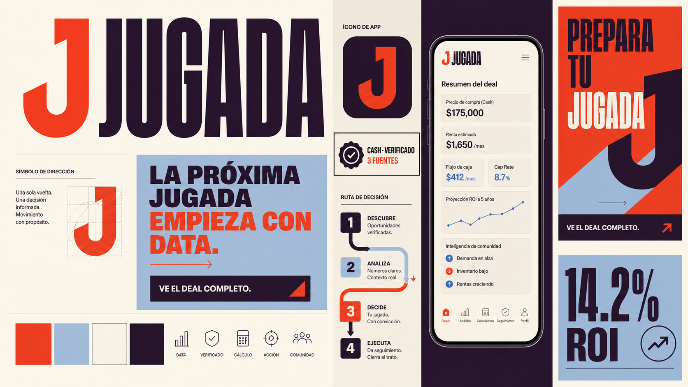
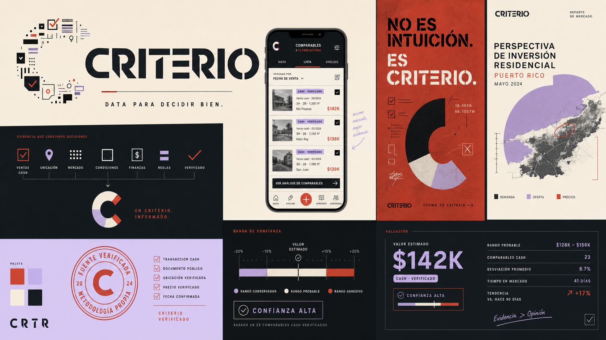
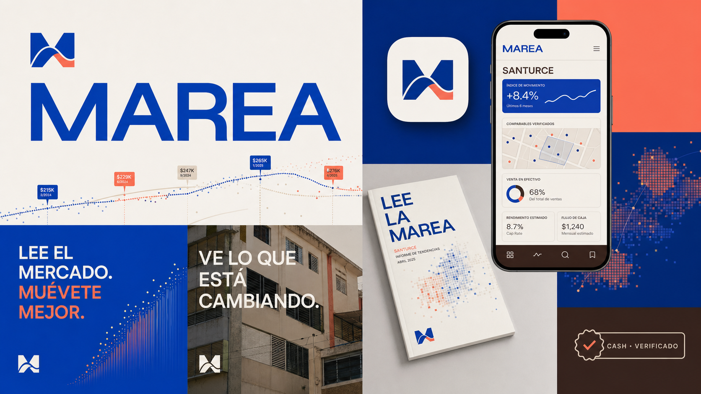
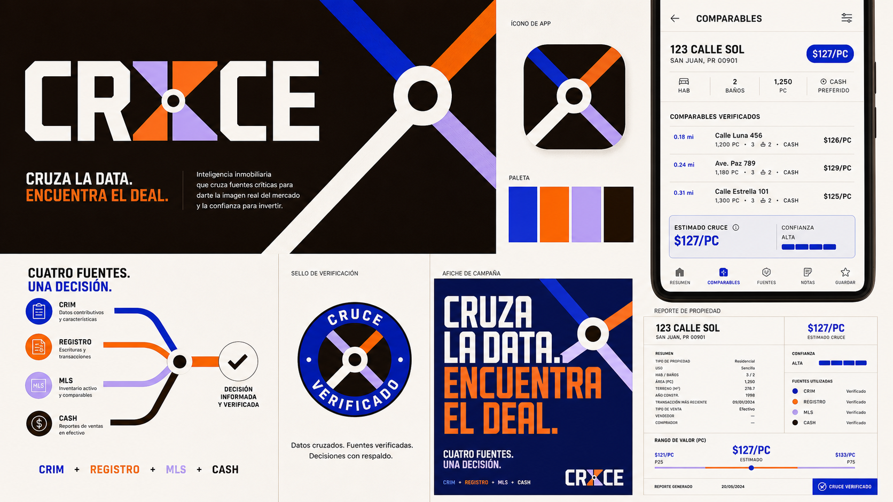

# Brand Exploration, Round 2

## Why this round is different

The first round leaned too heavily on property vocabulary and the cleverness of
finding a Spanish real-estate word. This round starts with the emotional value
of the product instead:

- You see information other investors miss.
- You know why a number should be trusted.
- You turn analysis into a move.
- You grow sharper through the community.

The brand should feel like an advantage, not a database.

## New naming territories

### The move

Names that make the platform feel active, confident, and close to the way the
community already speaks.

| Name | Brand idea | Possible line |
| --- | --- | --- |
| **Jugada** | The informed move, not the lucky guess | La próxima jugada empieza con data. |
| Mueve | Turn information into momentum | Ve el deal. Mueve con confianza. |
| Listo | Prepared and sharp at the same time | Listo para el próximo deal. |
| Paso | One clear next step | Tu próximo paso, con data. |

### The judgment

Names that position the platform as a way to think better, not merely search
faster.

| Name | Brand idea | Possible line |
| --- | --- | --- |
| **Criterio** | Better judgment built from evidence | No es intuición. Es criterio. |
| Firme | Verified information and a confident decision | Data firme. Decisiones firmes. |
| Base | The evidence beneath every investment thesis | Toda buena inversión tiene una base. |
| Aplomo | Calm confidence when the stakes are high | Invierte con aplomo. |

### The living market

Names that treat the market as something moving, local, and readable.

| Name | Brand idea | Possible line |
| --- | --- | --- |
| **Marea** | Read movement before making your move | Lee el mercado. Muévete mejor. |
| Pulso | Know what the market is doing now | Tómale el pulso al mercado. |
| Señal | Find the useful signal inside the noise | La señal detrás del deal. |
| Onda | Local knowledge moving through a network | Entra en la onda del mercado. |

### The connected truth

Names that express how the product combines public records, MLS information,
cash deals, and community intelligence.

| Name | Brand idea | Possible line |
| --- | --- | --- |
| **Cruce** | The truth appears where sources meet | Cruza la data. Encuentra el deal. |
| Trama | Every source adds to the complete picture | Toda propiedad tiene una trama. |
| Nexo | Data, people, and opportunities connected | Todo el mercado, conectado. |
| Suma | More sources create a better answer | Más data. Mejor decisión. |

## Shortlist

| Name | Strategic fit | Memorability | Cultural fluency | Product stretch | Energy |
| --- | ---: | ---: | ---: | ---: | ---: |
| **Jugada** | 5 | 5 | 5 | 5 | 5 |
| **Criterio** | 5 | 4 | 4 | 5 | 3 |
| **Marea** | 4 | 5 | 4 | 5 | 4 |
| **Cruce** | 5 | 4 | 4 | 5 | 4 |

## Concept 01: Jugada

### Position

The platform for investors who want their next move to come from evidence.

### Why it fits

“Jugada” already sounds natural in this community. It can describe a financing
strategy, a cash deal, a negotiation, or the next property in a pipeline. It
makes the user the protagonist. The platform does not promise to predict the
future. It helps the investor prepare the move.

### Verbal system

- Master line: **La próxima jugada empieza con data.**
- Product promise: **Ve el deal completo.**
- CTA: **Prepara tu jugada**
- Content series: **La jugada de la semana**
- AI assistant: **Copiloto Jugada**
- Endorsed launch: **Jugada, por Cancel**

### Visual world

- A directional `J` formed by one deliberate turn
- Move sequences, decision paths, and numbered actions
- Vermilion, powder blue, warm cream, and dark aubergine
- Bold, condensed display typography with a practical humanist text face
- Energetic and street-smart, without sports, casino, or gaming references

## Concept 02: Criterio

### Position

Investment intelligence that replaces hearsay with informed judgment.

### Why it fits

The product does more than provide numbers. It shows provenance, compares
sources, calculates returns, and helps people understand what the information
means. “Criterio” feels credible for a six-figure decision while remaining
human and teachable. It also stretches naturally into education, community,
reports, and future capital products.

### Verbal system

- Master line: **No es intuición. Es criterio.**
- Product promise: **Data para decidir bien.**
- CTA: **Forma tu criterio**
- Verification label: **Criterio alto**
- Editorial series: **Con criterio**
- Endorsed launch: **Criterio, por Cancel**

### Visual world

- A `C` assembled from evidence marks that resolve into one clear form
- Proof ticks, confidence bands, annotations, and source stamps
- Oxide red, pale lilac, bone, and near-black
- Authoritative typography with sharp cuts and large numeric moments
- Calm and rigorous, but never dressed like a bank

## Concept 03: Marea

### Position

The platform that helps investors read where the market is moving.

### Why it fits

Property markets are not static. Prices, financing, inventory, neighborhood
activity, and cash transactions move together. “Marea” gives the brand a
living quality and a subtle island origin without relying on flags, palms, or
tropical nostalgia. The idea can travel to any coastal or mainland Latino
market.

### Verbal system

- Master line: **Lee el mercado. Muévete mejor.**
- Product promise: **Ve lo que está cambiando.**
- CTA: **Lee la marea**
- Market index: **Nivel de mercado**
- Content series: **Sube / Baja**
- Endorsed launch: **Marea, por Cancel**

### Visual world

- Flow fields built from actual property and price data
- A compact `M` that rises and falls like a market curve
- Cobalt, coral, sand, and deep brown
- Wide, confident typography and large directional data graphics
- Expressive and alive, without becoming a beach or surf brand

## Concept 04: Cruce

### Position

The clearest market picture appears where independent sources meet.

### Why it fits

The moat is not one database. It is the intersection of CRIM, Registro, MLS,
cash-sale reports, and community knowledge. “Cruce” turns provenance and
cross-verification into the identity. It also speaks to the intersection of
Puerto Rico and the mainland, data and experience, analysis and action.

### Verbal system

- Master line: **Cruza la data. Encuentra el deal.**
- Product promise: **Cuatro fuentes. Una decisión.**
- CTA: **Cruzar comparables**
- Verification state: **Cruce verificado**
- Community contributors: **La Red Cruce**
- Endorsed launch: **Cruce, por Cancel**

### Visual world

- Independent paths meet at a verified center
- Cross-source overlays, junctions, and highlighted intersections
- Ultramarine, tangerine, pale violet, and dark chocolate
- Compact geometric display typography paired with highly legible product type
- Connected and forensic, without street signs or generic network diagrams

## Agency recommendation

**Jugada** is the strongest commercial brand in this round. It has the best
voice, the most campaign energy, and the closest relationship to how the
product turns analysis into action.

**Criterio** is the strongest trust brand. It is the best choice if the company
wants to feel more like a durable intelligence platform than a creator-led
membership product.

**Marea** is the strongest emotional brand. It has the richest visual world and
the most elegant Puerto Rico connection.

**Cruce** is the strongest product-story brand. It explains the proprietary
advantage without using a real-estate noun.

## Preliminary collision screen

This is a creative screen, not legal clearance.

- **Jugada** has broad sports and entertainment usage, including the active
  JugaData sports-analysis product. The exact concept remains viable for
  exploration, but betting-adjacent classes and messaging need careful review.
- **Criterio** is used by consultancies and software-service businesses in Latin
  America. It requires a proper class and similarity search.
- **Marea** is actively used by unrelated software and health applications.
  Its emotional strength comes with a relatively crowded digital-name field.
- **Cruce** is used by a software-development agency and unrelated apps. The
  real-estate intelligence category appears less directly occupied in this
  first screen, but legal clearance is still required.
- Exact `.com` domains for **Jugada**, **Criterio**, **Marea**, and **Cruce**
  are registered.
- At the time of review, registry lookups returned no record for
  `usajugada.com`, `jugadadata.com`, `criterioapp.com`, `criteriodata.com`,
  `usacriterio.com`, `mareadata.com`, `usamarea.com`, `crucedata.com`, and
  `usacruce.com`. No record is not a guarantee of availability.

A U.S. and Puerto Rico trademark attorney should search exact names, phonetic
neighbors, translations, and related marks across software, property data,
financial analysis, education, and community services before adoption.

## How to choose

Do not ask which logo people like most. Ask:

1. Which name sounds natural when you say, “Lo chequeé en ___”?
2. Which name would you trust before making a six-figure offer?
3. Which name could lead a YouTube episode, an app, and an investment report?
4. Which name would you remember without seeing the list again?
