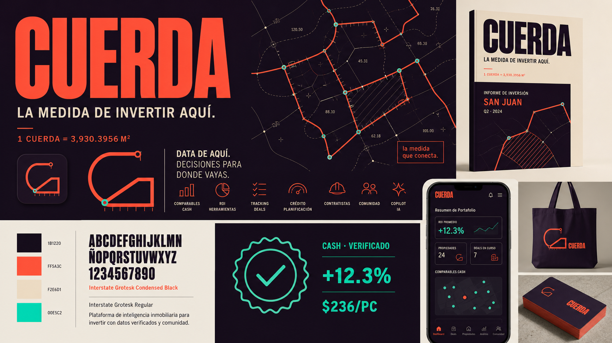
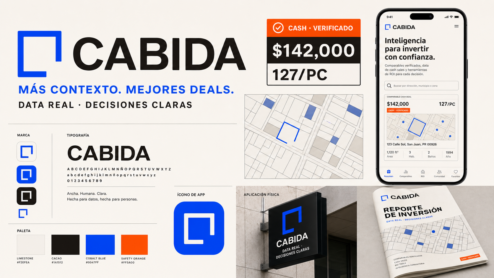
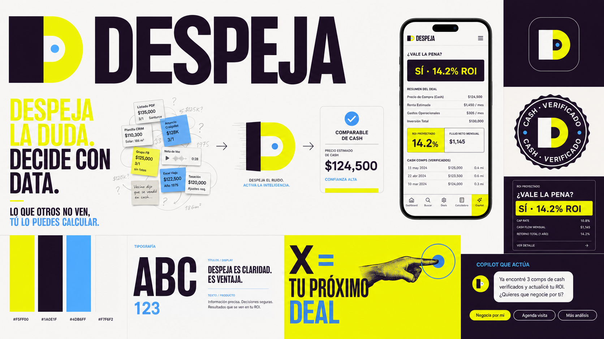

# Brand Exploration

## The opportunity

This business should not present itself as another real estate portal. Its real
product is **market visibility**: public records, MLS information, and cash-sale
data that normally stays inside realtor networks, converted into decisions an
investor can act on.

The strongest position is:

> The investment intelligence platform that shows Latino investors the part of
> the property market other tools miss.

The brand needs to hold four ideas at once:

1. **Ground truth**: verified prices, named sources, and visible freshness.
2. **Action**: comparables lead directly to ROI, financing, estimates, and a
   deal pipeline.
3. **Access**: knowledge that used to stay with realtors and coaches becomes
   usable by the investor.
4. **Home-field authority**: born from Puerto Rico rather than adapted to it,
   with the ability to travel to Latino markets across the United States.

## Brand essence

**See the whole market. Make the next move.**

### Personality

- Grounded, not institutional
- Candid, not simplistic
- Propulsive, not hyped
- Culturally fluent, not performative
- Expert, not intimidating

### What to avoid

- Rooflines, keys, doors, palms, skylines, or PR-flag shorthand
- Navy-and-gold “luxury real estate”
- Crypto or speculative-finance aesthetics
- Generic green analytics software
- A founder-merch identity that cannot outgrow Christopher's personal brand
- A cold data-terminal identity that makes beginners feel excluded

## Naming criteria

A strong name should:

- Sound natural in Spanish and be pronounceable in English
- Feel credible at `$30/month` today and as a larger data company later
- Stretch across comparables, calculators, credit, contractors, community, and
  a future fund
- Carry a story rooted in Puerto Rico without trapping the company there
- Avoid dependence on “Cancel,” whose existing audience equity is useful in
  Puerto Rico but whose English meaning becomes a liability in U.S. expansion
- Support an endorsed launch architecture such as **[new name], por Cancel**

## Naming territories

### 1. The land itself

Words from surveying, deeds, parcels, and the language of property.

| Name | Idea | Strength | Watch-out |
| --- | --- | --- | --- |
| **Cuerda** | Puerto Rico's official traditional unit for measuring land; also a continuous line that connects data and people | Most distinctive and culturally ownable | Meaning needs to be taught outside PR |
| **Cabida** | The surface area of a property; also room, place, or capacity | Serious, expandable, quietly rich | More technical and less immediately familiar |
| **Colinda** | Properties and people meeting at a boundary | Warm, network-oriented, easy to say | Less directly connected to investment analysis |
| Lote | A parcel, a group, and a portfolio | Short and concrete | Highly generic in the category |
| Mensura | Measurement and surveying | Precise and authoritative | Existing digital topography and software brands |

### 2. Clarity and proof

Words that turn scattered or hidden information into a confident decision.

| Name | Idea | Strength | Watch-out |
| --- | --- | --- | --- |
| **Despeja** | Clear the noise; solve for the unknown | Active, accessible, and highly campaignable | Less inherently tied to property |
| En Firme | A serious offer, a confirmed position, solid ground | Strong verbal territory: “decide en firme” | Existing legal-tech brands create clearance risk |
| Hecho | A fact and something completed | Direct, human, verifiable | Existing contractor marketplace conflicts with a future product area |
| Sello | Verification, provenance, contributor status | Natural data-trust system | Several active software companies use the name |
| Cotejo | Comparison and verification | Close to the core product | Very close to Coteja, an active price-intelligence app |

### 3. The investor's edge

Words about detecting movement and finding economic room.

| Name | Idea | Strength | Watch-out |
| --- | --- | --- | --- |
| Margen | The room between price and value | Investor-native and strategically sharp | Common finance term |
| Mitad | The missing half of the market | Powerful challenger story | Negative meaning unless the narrative is explained immediately |
| Vigía | The lookout that sees movement early | Memorable and visual | Active software brands in adjacent categories |
| Veta | A hidden vein of value | Distinctive metaphor | Several active data, finance, and technology brands |
| Cifra | Numbers turned into decisions | Clear and professional | Active financial analytics brands |

### 4. The network

Words about an ecosystem that grows more useful as more people contribute.

| Name | Idea | Strength | Watch-out |
| --- | --- | --- | --- |
| Fuente | Every number has a source; the network becomes the source | Perfect for provenance and editorial content | Very generic as a standalone mark |
| Suma | Public data plus cash deals plus community | Warm and expansive | Crowded financial category |
| Trato | A deal and a relationship | Human and commercial | Broad, with many existing uses |
| Junte | The community and data sources coming together | Locally warm and social | Active community app and less analytical |
| Compa | Comparable plus trusted companion | Friendly and memorable | More Mexican than Puerto Rican in tone |

## Recommended shortlist

| Rank | Name | Strategic fit | Distinctiveness | PR authenticity | U.S. Latino scalability | Ecosystem stretch |
| --- | --- | ---: | ---: | ---: | ---: | ---: |
| 1 | **Cuerda** | 5 | 5 | 5 | 4 | 4 |
| 2 | **Cabida** | 5 | 4 | 4 | 4 | 5 |
| 3 | **Despeja** | 5 | 4 | 3 | 5 | 5 |
| 4 | Colinda | 4 | 4 | 4 | 4 | 5 |
| 5 | Mitad | 4 | 5 | 3 | 4 | 4 |
| 6 | Margen | 4 | 3 | 3 | 5 | 4 |
| 7 | Fuente | 4 | 3 | 3 | 5 | 5 |
| 8 | En Firme | 5 | 3 | 4 | 4 | 4 |

## Recommendation

### Choose **Cuerda** if the ambition is to build a brand nobody else could
have credibly originated.

It starts with an actual Puerto Rican real-estate truth: the cuerda remains the
official local unit used to measure land. That makes the name culturally
specific without resorting to symbols, slang, or nostalgia. Its second meaning,
a continuous line, naturally represents the realtor network, source
provenance, property boundaries, and the thread from data to decision.

The unfamiliarity outside Puerto Rico is an asset if the story is told well.
Instead of sounding like a generic proptech, it gives the company something
worth explaining and remembering.

Recommended launch lockup:

> **Cuerda, por Cancel**

Recommended master line:

> **Data de aquí. Decisiones para donde vayas.**

Recommended PR campaign line:

> **La medida de invertir aquí.**

Possible product architecture:

- Cuerda Comps
- Cuerda Calcula
- Cuerda Deals
- Cuerda Crédito
- Cuerda Red
- Cuerda Copiloto

### Choose **Cabida** if the priority is a calmer, more institutional product
company.

Cabida is the best balance of category relevance and future stretch. It can
credibly hold professional analytics, reports, data licensing, community, and
eventually capital products. The language is rooted in deeds and land, while
the broader meaning of “having room” supports an inclusion story for Latino
investors.

Recommended line:

> **Más contexto. Mejores deals.**

### Choose **Despeja** if the priority is growth, accessibility, and a loud
consumer challenger.

Despeja turns the product experience into a verb. It captures what the copilot
and tools actually do: remove noise, solve for the unknown, and produce the next
move. It is the easiest of the three to use in campaigns, onboarding, and
education.

Recommended line:

> **Despeja la duda. Decide con data.**

## Visual concept summaries

### Cuerda: measured connection

- A continuous measured line becomes a `C`, a parcel, and a network
- Deep aubergine, papaya coral, sand, and verified mint
- Tall, compressed grotesk typography inspired by survey labels and street
  numbering, without becoming a technical costume
- Measurement ticks, boundary nodes, and source trails become the graphic
  language
- Best for: a bold masterbrand with the strongest Puerto Rico origin story

### Cabida: open intelligence

- An open parcel boundary creates a distinctive `C` and a metaphor for access
- Warm limestone, cacao, cobalt, and a safety-orange verification accent
- Wide, humanist grotesk typography that feels serious but not corporate
- Parcel grids, open brackets, and verified-source labels structure the system
- Best for: a trusted product and future data company

### Despeja: solve the deal

- An obscuring block slides away from a `D` to reveal the answer
- Electric lemon, deep plum, sky blue, and paper white
- Expressive compact display type paired with highly legible product type
- Messy source fragments resolve into a single comparable, ROI, or action
- Best for: a high-energy challenger brand and education-led acquisition

## Preliminary availability screen

This is an early collision and registry screen, not legal clearance.

- Exact `.com` domains for **Cuerda**, **Cabida**, and **Despeja** are already
  registered.
- At the time of review, registry lookups returned no record for several
  practical alternatives, including `cuerdaapp.com`, `usacuerda.com`,
  `cuerdapr.com`, `cabidaapp.com`, `getcabida.com`, `usacabida.com`,
  `despejaapp.com`, `somosdespeja.com`, and `usadespeja.com`.
- **Cuadra** was removed from the shortlist because an active Spanish-language
  real-estate management platform already uses it.
- **Mensura** was downgraded because active digital-topography and inventory
  products already use it.
- **Coteja/Cotejo**, **Rinde**, **Cifra**, **Sello**, **Firme**, and **Veta**
  carry meaningful adjacent software conflicts.
- A trademark attorney should run a Puerto Rico/U.S. federal clearance search,
  including related spellings and relevant software, real-estate, education,
  financial, and marketplace classes, before adoption.

Domain status can change at any time. No domain should be treated as secured
until it has been registered.

## Recommended next decision

Test only the three developed territories with Christopher and 8–12 community
members. Do not ask “which logo do you like?” Ask:

1. Which name would you trust with a six-figure property decision?
2. Which name would you remember tomorrow without seeing the list?
3. Which one feels born here but still works in Orlando, Houston, or New York?
4. Which one could become bigger than a comps tool?

Use the answers to choose a naming direction, then perform legal clearance
before refining the identity.
