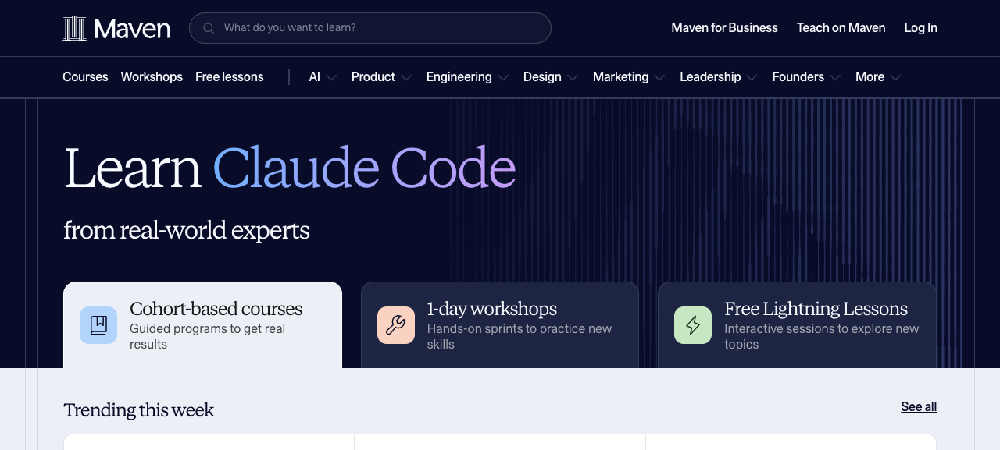
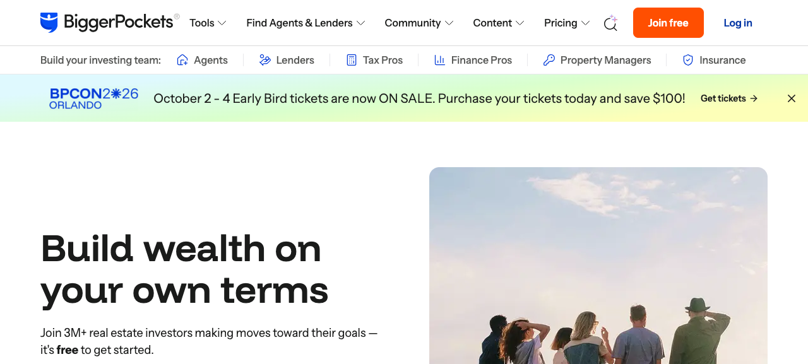
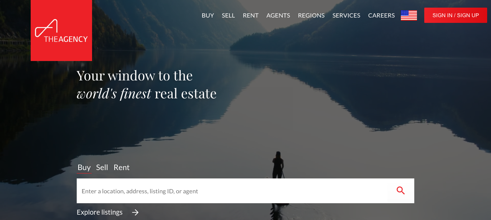
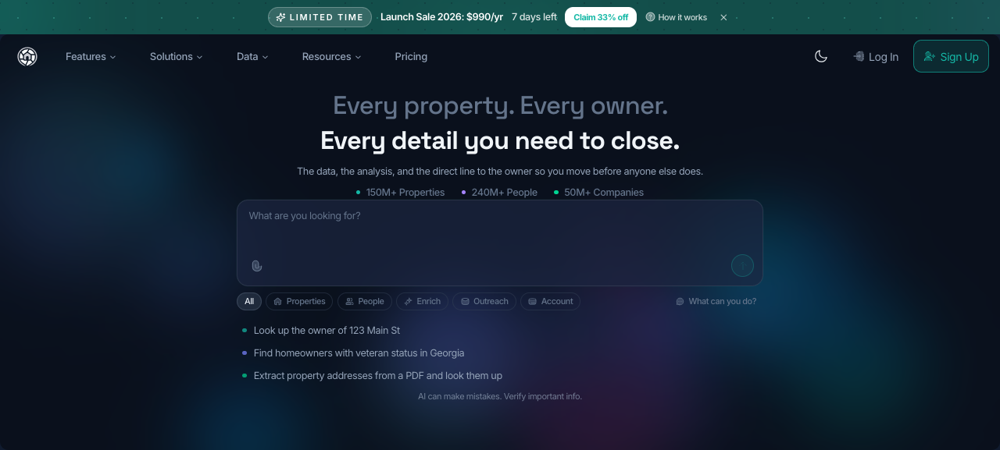
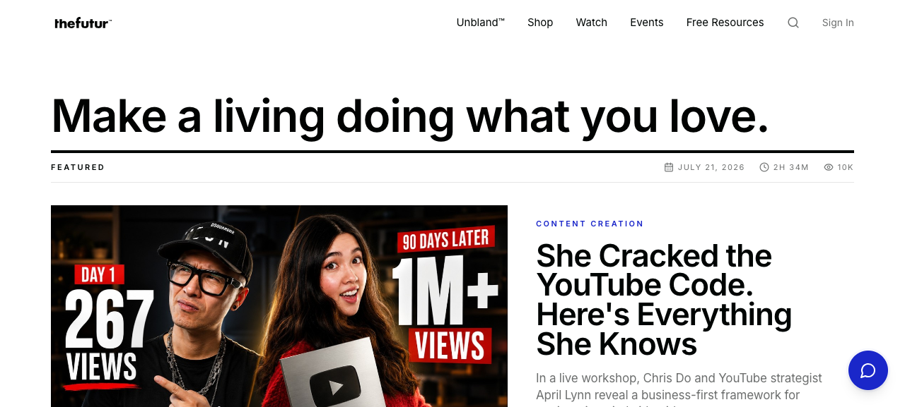
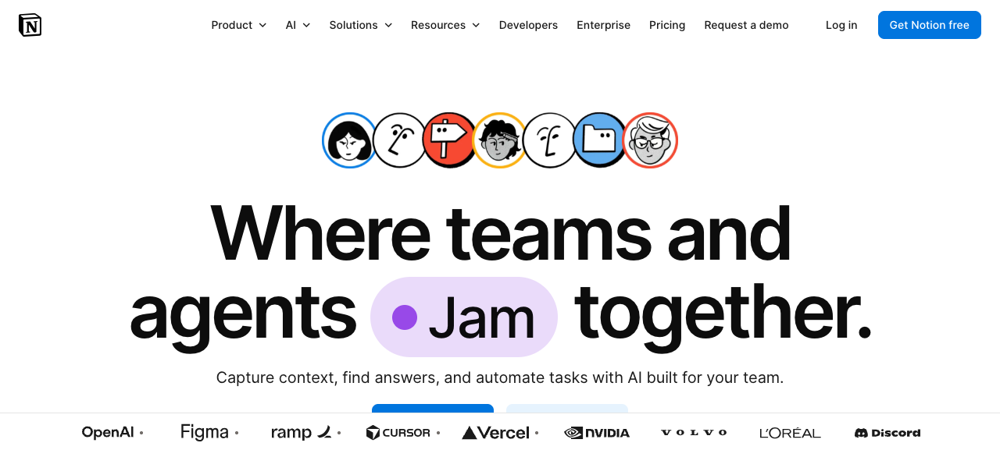

# Unas preguntas rápidas sobre tu marca personal

Christopher, antes de pedirte un montón de información, hicimos la asignación.
Vimos el trabajo que ya has construido con **CancelBienesRaices, Creciendo tu
Portafolio y Sherah**, además de tu comunidad, tus productos, los funnels y el
contenido que tienes en Instagram, TikTok, YouTube y Skool. También conocemos
la nueva plataforma que estamos desarrollando contigo. La buena noticia es que
no estamos comenzando de cero: ya tienes audiencia, experiencia, resultados y
una operación real. Lo que toca ahora es organizar todo eso bajo una marca
clara, sólida y que te dé espacio para seguir creciendo. Para aterrizar bien el
alcance y prepararte un estimado justo, solo necesitamos que nos confirmes lo
siguiente. Puedes contestar en bullets o con una nota de voz de 5–10 minutos.

## 1. ¿Lo estamos entendiendo bien?

Nuestra lectura inicial es:

- **Christopher Cancel** sería la figura principal: tu historia, visión,
  contenido y autoridad.
- **CancelBienesRaices** representaría la operación y las transacciones de real
  estate.
- **Creciendo tu Portafolio** sería la parte de educación, comunidad y
  programas.
- La **nueva plataforma** tendría su propia marca, respaldada por ti.
- Nos falta confirmar qué lugar debe ocupar **Sherah** dentro de todo esto.

¿Cambiarías algo de ese mapa?

## 2. ¿Qué te gustaría lograr primero?

Escoge las dos o tres prioridades más importantes para los próximos 12 meses:

- organizar y profesionalizar todo el ecosistema;
- atraer más clientes, inversionistas u oportunidades;
- crecer y monetizar la comunidad;
- fortalecer la venta de programas y mentorías;
- lanzar la nueva plataforma;
- crecer tu autoridad, contenido, prensa o speaking;
- otra prioridad que debamos conocer.

## 3. ¿Qué debe salir junto con la nueva marca?

¿Hay algo que definitivamente quieras lanzar desde la primera fase —por
ejemplo, un website nuevo, campaña, fotos/video, ads, email/CRM,
automatizaciones o templates de contenido— o prefieres que te recomendemos el
orden más inteligente para hacerlo por etapas?

## 4. ¿Cómo quieres que se sienta?

En tus propias palabras, ¿cómo quieres que la gente describa a Christopher
Cancel después de conocer la nueva marca? Con tres o cuatro palabras es
suficiente. También dinos si hay algo de tu presencia actual que quieras
conservar o algo que definitivamente no se sienta como tú.

## Un juego visual rápido

Esta sección **no se interpreta al pie de la letra**. Que escojas una referencia
no significa que vamos a copiarla, utilizar sus colores o llevar la marca en esa
misma dirección. Es solamente una manera sencilla de entender dónde está tu
mente ahora mismo: qué nivel de energía, confianza, sofisticación, cercanía o
modernidad te atrae.

Sin pensarlo demasiado, escoge **dos y un máximo de tres** referencias. No
tienes que explicar tu selección, pero si algo específico te llamó la atención,
puedes mencionarlo. Tampoco importa si te gusta el negocio; aquí solo estamos
mirando la presencia visual.

| A                                                                                                 | B                                                                                                       |
| ------------------------------------------------------------------------------------------------- | ------------------------------------------------------------------------------------------------------- |
|                             |            |
| ☐ **A — [Maven](https://maven.com/):** premium, educativo y sereno                                | ☐ **B — [BiggerPockets](https://www.biggerpockets.com/):** accesible, optimista y centrado en comunidad |
| C                                                                                                 | D                                                                                                       |
|            |             |
| ☐ **C — [The Agency](https://www.theagencyre.com/):** aspiracional, cinematográfico y sofisticado | ☐ **D — [DealMachine](https://www.dealmachine.com/):** tecnológico, preciso y orientado a data          |
| E                                                                                                 | F                                                                                                       |
|                   |                            |
| ☐ **E — [The Futur](https://www.thefutur.com/):** directo, editorial y con personalidad           | ☐ **F — [Notion](https://www.notion.com/):** simple, humano y organizado                                |

_Capturas de los websites oficiales, tomadas únicamente como referencia
visual._

## 5. ¿Hay algo importante que no encontramos?

¿Existe algún website, cuenta, negocio, producto, lista de email, CRM, campaña,
testimonio, alianza o material privado que debamos mirar? También confírmanos si
alguno de los activos que encontramos ya no se utiliza.

## 6. ¿Hay una fecha que debamos tener en mente?

Entendemos que tú darás la aprobación final. Solo necesitamos saber si existe
una fecha real para lanzar y quién puede ayudarnos con accesos o coordinación
cuando llegue el momento.

## Referencia de inversión

Para que tengas contexto desde el principio —sin convertir esto en un paquete
genérico— anticipamos aproximadamente **$12,000–$20,000** para la estrategia,
arquitectura, mensajes, identidad y sistema central de lanzamiento.

Si decidimos lanzar en conjunto un website custom, producción de contenido,
publicidad y digital placement, email/CRM o automatizaciones, la fase inicial
podría moverse hacia **$20,000–$40,000+**. No tienes que escoger un rango ahora.
Con tus respuestas te recomendaremos qué debe entrar primero, qué puede
trabajarse después y cuál sería el estimado específico para tus necesidades.
